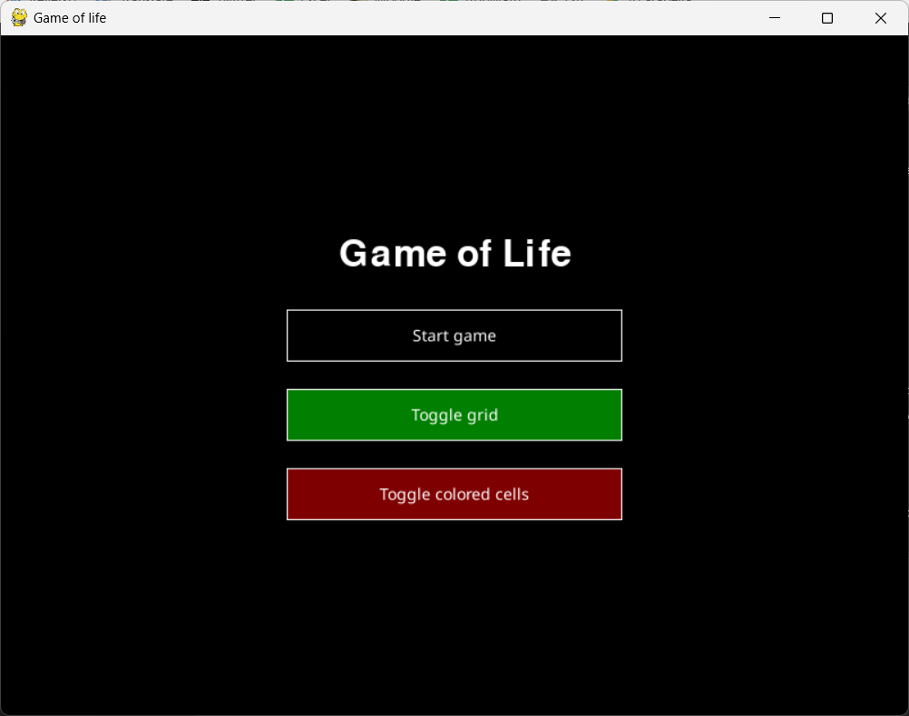
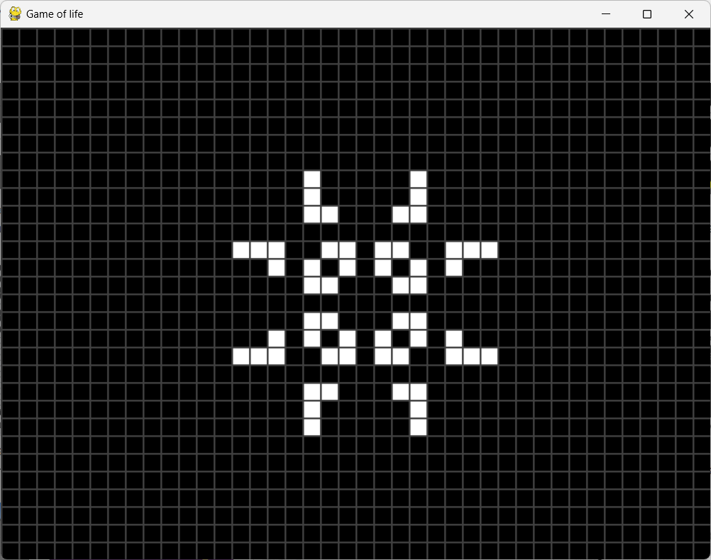
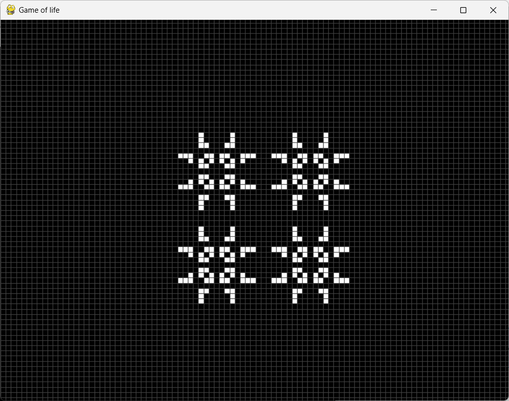
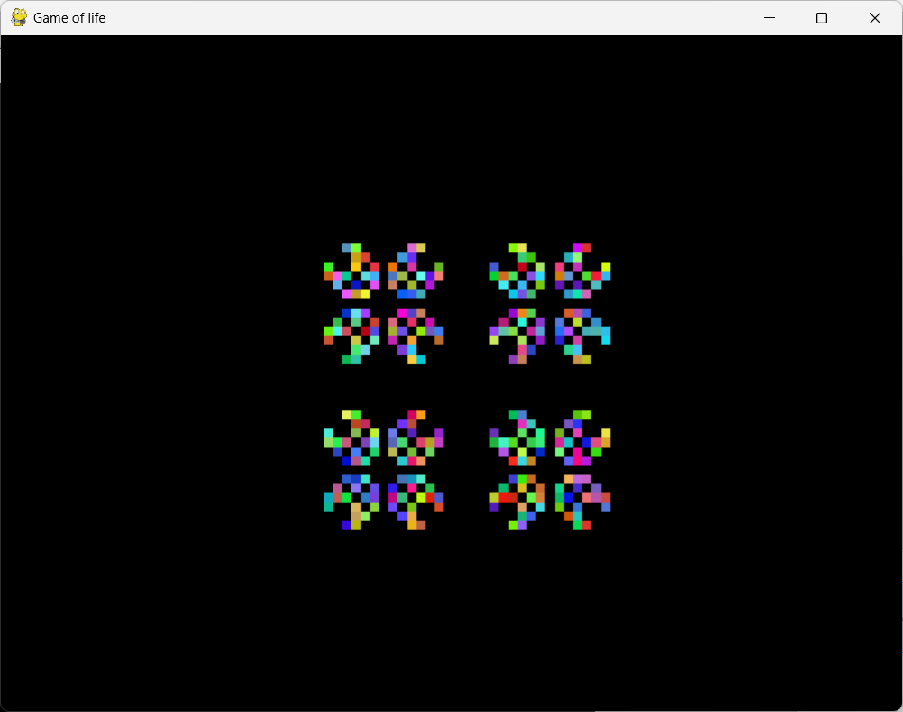
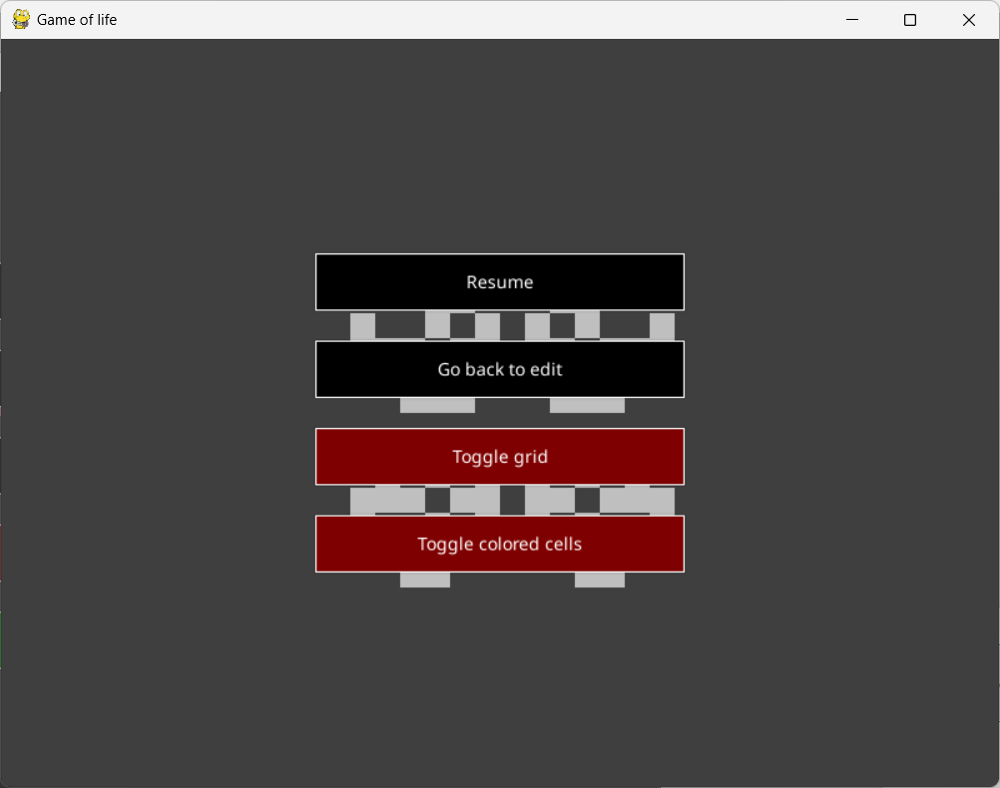
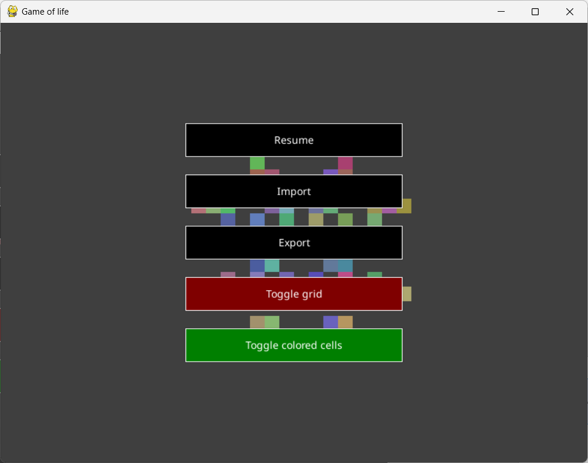
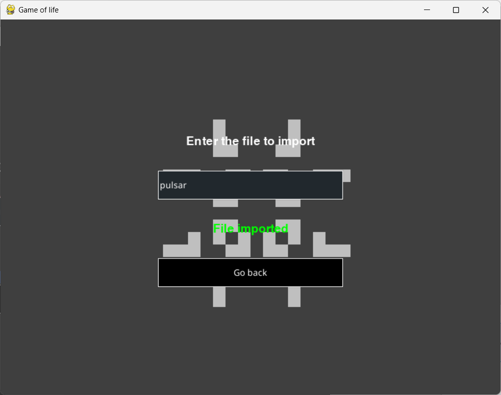

# Conway's Game of Life

This repository contains an interactive implementation of Conway's Game of Life using Pygame. The Game of Life is a cellular automaton devised by mathematician John Conway, where cells evolve over discrete time steps based on three simple rules:

1. **Birth**: A dead cell with exactly three live neighbors becomes alive.
2. **Survival**: A live cell with two or three live neighbors stays alive.
3. **Death**: A live cell with fewer than two or more than three live neighbors dies.

Despite its simplicity, the Game of Life generates highly complex and unpredictable patterns, making it a fascinating study in artificial life, mathematics, and computer science.

## Features

- **Resizable window** – Adjust the game window to fit your screen.
- **Adjustable zoom** – Zoom in and out to view different levels of detail.
- **Toggleable grid** – Show or hide the grid overlay.
- **Toggleable colors** – Switch between white and colorful cells.
- **Pause the game** – Pause the simulation.
- **Import/export initial grid** – Export and load initial configurations to recreate patterns.
- **Go back to editing the initial configuration after starting** – Modify your setup even after beginning the simulation.
- **Press Enter to start** – A simple way to begin the simulation.
- **Unlimited grid** – The grid expands dynamically as patterns evolve.

## Screenshots

  
  

  
  

  
  

  
  

